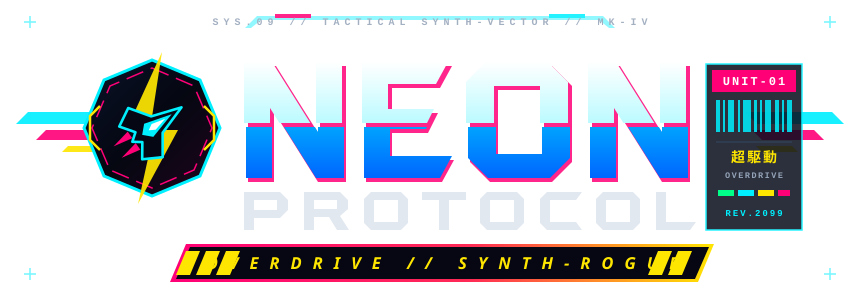

<div align="center">
  

  ### // OPEN-WORLD CYBER-ARENA SYNTH-ROGUE // MK-IV INTERCEPTOR //

  [](https://github.com/phanaach4889/PK-game/actions/workflows/deploy.yml)

  **[Play Live on GitHub Pages (`phanaach4889.github.io/PK-game`)](https://phanaach4889.github.io/PK-game/)** · **[Local Entry (`index.html`)](./index.html)** · **[Master Vector Logo (`neon_protocol_logo.svg`)](./neon_protocol_logo.svg)**
</div>

---

## // SYSTEM OVERVIEW

**NEON PROTOCOL // OVERDRIVE** is a zero-dependency, 60 FPS HTML5 Canvas & WebAudio open-world cyber-arena action game built in a single self-contained file with **100% custom multi-layer vector SVG icons & canvas geometry (zero emojis)**. Pilot the **Valkyrie Mk-IV Interceptor** across a **4,200 × 4,200** multi-sector cyber-grid, harness a procedural **4-Track Multi-BPM Synthwave/Cyberpunk WebAudio Engine**, unleash **6 Overclocked Tactical Skills**, complete **Live Cyber-Contracts**, and survive an escalating 6-tier enemy threat protocol.

---

## // KEY FEATURES

### // 6-Skill Active Tactical Arsenal (`[Q]` `[R]` `[F]` `[X]` `[E]` + `[SPACE]`)
- **`[Q]` / `Right Click` — Dimension Rift Katana (3-Hit Combo & Riposte)**:
  - **3-Step Combo System**: Every 3rd slash (or any slash during Overdrive/Frenzy) unleashes an **X-Cross Dimension Cut** with twin intersecting plasma arcs, spatial X-rift lightning across cleaved targets, and `+2` bonus crescent waves.
  - **Hex-Parry Riposte**: Deflecting enemy projectiles reflects them at `2.6x` speed & `4.2x` damage and triggers a **Golden Hex-Parry Riposte Ring** that zaps nearby hostiles.
- **`[R]` — Omega Ion Laser + Autonomous Fin-Funnel Bits**:
  - Sweeping `1,150px` orbital plasma lance accompanied by **2+ Autonomous Floating Fin-Funnel Bits** that flank your interceptor and fire converging cyan sub-lasers into the main beam.
  - Melts enemies, vaporizes enemy bullets, arcs chain-lightning to nearby targets, and ends with an **Omega Rail Finale** burst.
- **`[F]` — Chrono-Stasis Singularity Dome (Orbital Bullet Capture & Chrono-Lances)**:
  - Deploys a `265px+` time-freeze matrix at your cursor (`82%` slow + `+50%` damage vulnerability) with **Temporal Tether Chains** locked onto every trapped hostile.
  - **Orbital Bullet Capture**: Enemy projectiles entering the dome are captured into a swirling tangential orbit around the perimeter instead of hitting you.
  - **Chrono-Lance Shatter**: Press **`[F]` again early** (or let the dome expire) to detonate a **Temporal Shatter Nova** that fires **8+ piercing radial Chrono-Lance blades**.
- **`[X]` — Phantom Squadron + Voltaic Laser Tether + Quantum Phase-Swap**:
  - Spawns a holographic wingman clone that taunts enemies and fires rapid twin plasma bolts while launching a **16+ Homing Micro-Missile Salvo**.
  - **Voltaic Laser Tether**: Projects a high-voltage plasma beam between your ship and the active clone that electrocutes any enemy crossing the line.
  - **Quantum Phase-Swap**: Press **`[X]` while a clone is active** to instantaneously **swap positions** with your hologram, unleashing dual EMP shockwaves at both locations and 8 bonus homing missiles!
- **`[E]` — Seraphim Overdrive Supernova**:
  - Unfolds **6-Winged Seraphim Hard-Light Energy Pinions** behind your ship for 6 seconds (`2.5x` fire rate, `+45%` speed, zero heat), converts active enemy bullets on screen into allied homing missiles, and calls down **Orbital Judgment Laser Pillars** onto high-HP targets.
- **`[SPACE]` / `Shift` — Phase-Rift Siphon Dash**:
  - High-speed invulnerability dash that leaves a holographic afterimage trail and **siphons nearby enemy projectiles into `+6% Overdrive` charge per bullet**.

### // Live Cyber-Contracts (`[C]`) & 7 Interactive World Structures
- **4 Dynamic Mid-Combat Contracts (`[C]`)**:
  1. **Neon Drift Slalom** — Thread 5 sequential golden holo-gates before the timer expires.
  2. **Orbital Payload Heist** — Hold inside the Orbital Data Core ring while fending off security ambushes.
  3. **VIP Nemesis Bounty** — Hunt down and eliminate the high-speed Crimson Nemesis VIP gunship.
  4. **Dimension Katana Blitz** — Score rapid Katana parries and close-range cleaves.
- **7 Open-World Structures**: Augmentation Shrines, Quantum Data Vaults, Allied Ion Turrets, Slipstream Boost Gates, Volatile EMP Pylons, Dimensional Warp Gates, and **Neon Jackpot Obelisks**.

### // 3 Selectable Threat Protocols (`[T]`) & 6-Tier Enemy Escalation
Switch threat levels on the fly with **`[T]`** or the HUD badge:
- **`OVERCLOCK` (`1.25x` Threat)** — Aggressive armed Sector 1 vanguard, early Blade Strikers & `[ELITE]` Hunters.
- **`NIGHTMARE` (`1.65x` Threat / `1.5x` Score)** — Relentless multi-directional assault waves and faster enemy fire.
- **`GODSLAYER` (`2.20x` Threat / `2.25x` Score)** — Maximum bullet-hell density and apex boss fleets.

---

## // FLIGHT & TACTICAL CONTROLS

| Input | Action |
| :--- | :--- |
| **`W A S D` / `Arrow Keys`** | Directional Thrusters |
| **`Mouse Cursor`** | 360° Turret & Ion Beam Aiming |
| **`Left Click`** | Fire Primary Weapon System |
| **`Spacebar` / `Shift`** | **Phase-Rift Siphon Dash** *(I-Frames + Bullet-to-Overdrive Siphon)* |
| **`Q` / `Right Click`** | **Dimension Rift Katana** *(3-Hit X-Slash Combo & Hex-Parry Riposte)* |
| **`R`** | **Omega Ion Laser + Autonomous Fin-Funnel Bits** |
| **`F`** | **Chrono-Stasis Dome** *(Press `[F]` again to Shatter + Chrono-Lances)* |
| **`X`** | **Phantom Clone + Tether** *(Press `[X]` again to Quantum Phase-Swap)* |
| **`E`** | **Seraphim 6-Winged Overdrive** *(At 100% Charge)* |
| **`C` / `T`** | **Trigger Cyber-Contract (`[C]`)** / **Cycle Threat Mode (`[T]`)** |

---

## // CONTINUOUS DEPLOYMENT

Every push to `main` automatically deploys to **GitHub Pages** via [`.github/workflows/deploy.yml`](./.github/workflows/deploy.yml).
To sync local changes, commit, and push in one step:

```powershell
.\deploy.ps1 -Message "feat: update gameplay"
```
